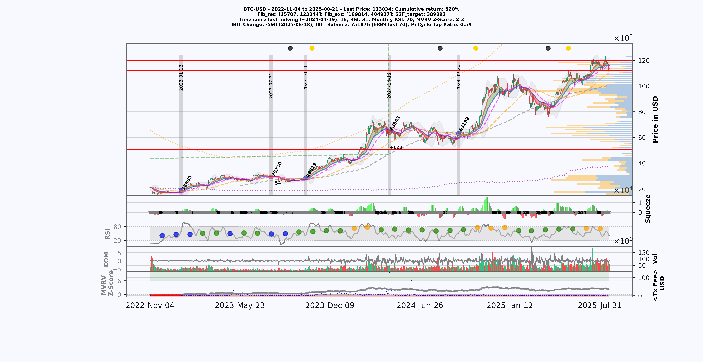
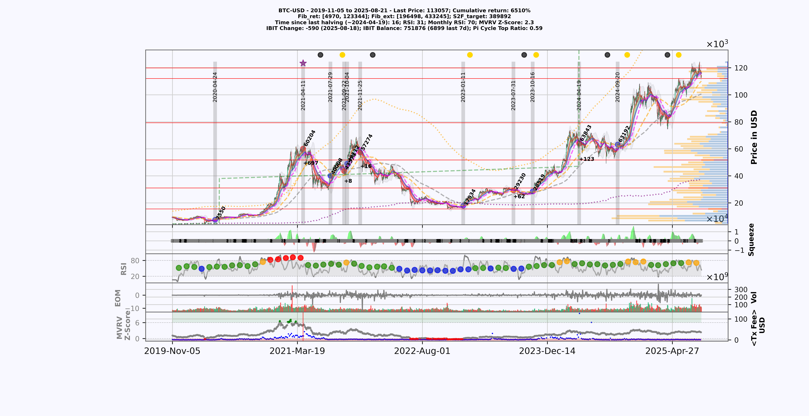

# Bitcoin Trading Indicator for Informed Investment Decisions
Advanced Bitcoin indicator for strategic investment decisions, delivering consistent returns while minimizing drawdown risk.

## Introduction

This repository offers a comprehensive investment strategy for Bitcoin (BTC) based on combining multiple technical indicators. Combining technical indicators and real-time on-chain data, investors can make informed decisions regarding entry and exit points in the BTC market. This startegy delivers consistent returns while minimising drawdown risk. The aim of this implementation is to provide a holistic approach to BTC investments, considering both trend direction and momentum signals.

## Cumulative Return with Minimal Drawdown Risk

This implementation is designed to help achieve a cumulative return with minimal drawdown risk. By combining multiple indicators and considering additional factors such as  trading volume, ease of movement and RSI, investors can better navigate the volatile BTC market while aiming for consistent returns.

## Example period

The example output showcases market behavior from November 2022 to August 2025, demonstrating precise market entries and capitalizing on buy and sell opportunities, thereby achieving a cumulative return of ~520%. Gray vertical bars indicate entry and exit time-positions, whereby red dots are sell points and blue dots are buying points.

## Performance

This script has demonstrated strong performance over the past six years (2019 - 2025), accurately identifying both the top and bottom of the Bitcoin market, thereby avoiding 412 days of continuous market downtrend. This has resulted in an impressive 6510% return, compared to a buy and hold strategy that would have yielded "only" 1500% for the same period and considerably higher risk!

## Some indicators and on-chain data included in this implementation

- **Squeeze Momentum Indicator**: Identifies the beginning and end of trends by combining Bollinger Bands and Keltner Channels.
- **Moving Average Divergence Convergence (MACD)**: used to determine trend direction through the crossing of short-term and long-term moving averages.
- **Relative Strength Index (RSI)**: Evaluates overbought or oversold conditions in BTC's price, providing insights into potential reversal points.
- **Smooth Momentum**: A smoothed version of the momentum indicator to provide clearer signals.
- **Ease-of-Movement (EOM)**: Measures price change relative to volume, highlighting trend strength and potential reversals.
- **MVRV Z-Score**: identifies Bitcoin overvaluation or undervaluation by comparing market and realized value.

## Usage Note

This script was developed solely for personal investment decision-making. If you're interested in utilizing it for your own purposes, feel free to get in touch.

## Contributors

- [Sebastian Ehrig](https://github.com/Sebastian-ehrig)
