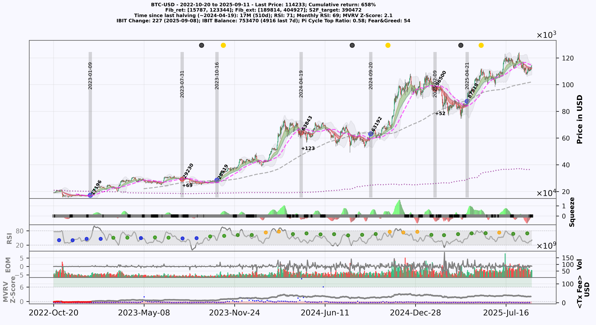
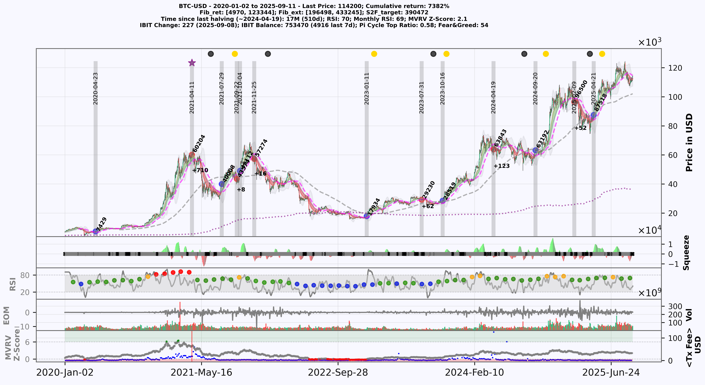
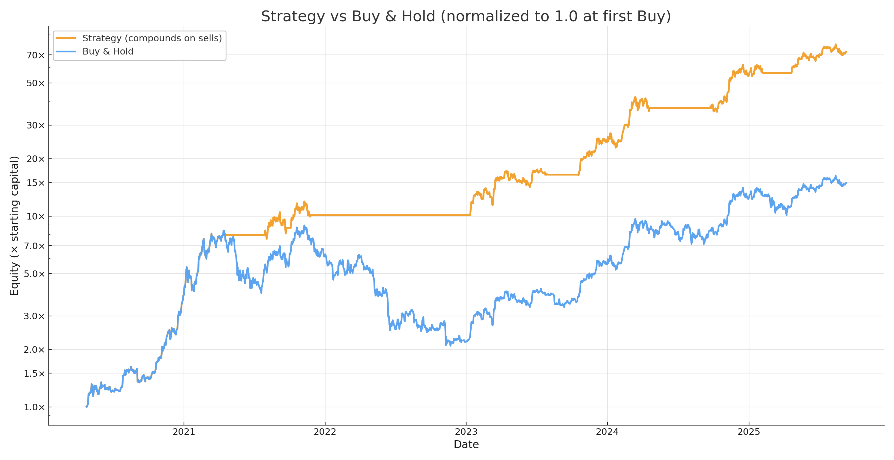
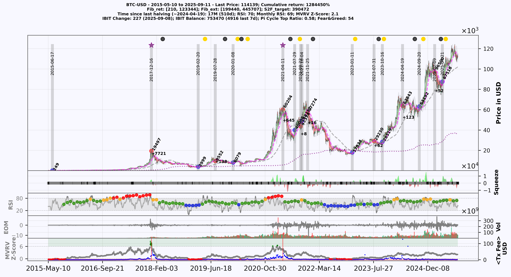

# Advanced Bitcoin Trading Strategy
Bitcoin trading strategy aimed at delivering consistent returns while minimizing drawdown risk.

## Introduction

This implementation provides a comprehensive investment strategy for Bitcoin (BTC). It combines multiple technical indicators and real-time on-chain data, which allows investors to make informed decisions regarding entry and exit points in the volatile BTC market. The strategy is designed to help achieve cumulative returns while minimising drawdown risk. The aim is to provide a holistic approach to BTC investments, considering both trend direction and momentum signals. Signals are generated on daily candles and are intended for spot BTC exposure; no leverage or short positions are assumed.

**In a nutshell**: It tries to find the best entry opportunity and exits the market when it becomes too risky. 

Backtest results use daily data and exclude leverage. **Figures are for research only, not financial advice!**

## Example period

The example showcases market behavior from October 2022 to September 2025, demonstrating precise market entries and capitalizing on buy and sell opportunities, thereby achieving a **cumulative return of ~658%**. This highlights how the combination of technical and on-chain signals **consistently identifies trends** and **optimal entry/exit points**, across changing market conditions.

The main plot displays the Bitcoin price as an OHLC candlestick chart. Gray vertical bars mark entry and exit positions, with red dots denoting sell points and blue dots denoting buy points. The purple dotted line represents the long-term holder realized price. Dashed magenta and gray lines show the 50- and 200-day moving averages, with their intersections highlighted as yellow dots (golden crosses) and black dots (death crosses). Below the main plot are key indicators: (1) squeeze momentum, (2) RSI with colored dots indicating monthly RSI levels from blue (low) to red (high), (3) volume and EOM, and (4) MVRV Z-score and transaction fees.

## Performance

This strategy has demonstrated strong performance between 2019 and 2025, accurately identifying both the top and bottom of the Bitcoin market, thereby **avoiding 571 days of continuous market downtrend** (vs. being fully exposed with buy-and-hold).  
This resulted in an impressive **return of ~74.8× (+7,382%)** (including the open position) - compared to a buy-and-hold strategy that would have yielded "only" ~12.8× (+1,178%) for the same period, and with considerably higher risk. During prolonged downtrends the strategy emphasizes capital preservation by stepping aside rather than forcing exposure.

---

### Detailed Performance Evaluation (Dec 2019 – Sep 2025)

Signals detected: **13** total (7 buys / 6 sells), leaving one open position.

**Completed trades (6 round-trips):**
- **Win rate:** 100% (no losing trades)  
- **Realized compounded return:** ~56.4× (+5,542%)  
- **CAGR (realized):** ~132% per year (2020-04-24 → 2025-02-09)  
- **Buy-and-hold over same window:** ~12.8× (+1,178%)  

**Including the current open position:**
- Latest buy: 2025-04-21 @ $87,519  
- Current price: $114,100 (as of 2025-09-11) → +30.4% unrealized 
- **Compounded return including open:** ~74.8× (+7,382%)  
- **CAGR including open:** ~122% per year  

**Exposure profile:**
- **Average days held per trade:** ~165 (median 164)  
- **Total time in market:** ~50% of the full period (988 / 1,964 days)  
- **Total time out of market (in cash):** 764 days  

**Trade log summary:**

| Buy date   | Buy price | Sell date   | Sell price | Return | Days held |
|------------|-----------:|-------------|-----------:|-------:|----------:|
| 2020-04-24 | $7,551     | 2021-04-11  | $60,205    | +697%  | 352 |
| 2021-07-29 | $40,008    | 2021-09-22  | $43,575    | +8.9%  | 55  |
| 2021-10-04 | $49,113    | 2021-11-25  | $57,275    | +16.6% | 52  |
| 2023-01-11 | $17,935    | 2023-07-31  | $29,230    | +63.0% | 201 |
| 2023-10-16 | $28,519    | 2024-04-19  | $63,844    | +124%  | 186 |
| 2024-09-20 | $63,193    | 2025-02-09  | $96,500    | +52.7% | 142 |

Open trade: **2025-04-21 @ $87,519 → $114,100** (+30.4%)

---

### Trading Strategy vs. Buy & Hold

The following chart compares the compounded strategy equity curve against a simple buy-and-hold benchmark. Both curves are normalized to **1.0 at the first Buy**. It highlights how the trading strategy side-steps bear markets while buy-and-hold suffers deep drawdowns.

Note: The **strategy’s equity curve** compounds only on executed trades and shows **55× realized growth**, or **73.5× including the open position**.

---
## Backtested performance on historical data (2014 - 2025)

In addition, this strategy has also been backtested on historical data yielding consistent returns over an extended timeframe (Sept 2014 - Aug 2025). In particular, it successfully predicted the BTC bear-market bottom in 2015, 2019, and 2022 as well as the market top of the 2017 and 2021 bull-market. However, if this strategy continues to work in the future remains to be seen. Out-of-sample behavior may differ if market microstructure or on-chain dynamics change

---
## Current market stage

The panel below shows the market stage since the last breakout in Nov 20224.  
Green/red shaded areas indicate upward or downward trends. The volume profile on the right shows where trading has concentrated across price levels, revealing areas of strong market participation. Horizontal lines indicate support and resistance zones derived from those high- and low-volume areas.

<em>Notes:</em> Price shown in USD. Shading = short-term MACD spread; not a standalone signal. Volume profile peaks often align with **support/resistance**. Figure last updated: 2025-09-11.

The figure above highlights BTC’s price evolution between March 2024 and September 2025:  
- A prolonged consolidation phase in mid-2024, followed by a sharp breakout into late 2024.  
- Strong upward momentum until April 2025, when a new **buy signal** was triggered (~$87.5k).  
- Since then, BTC has retested support levels around $100k multiple times, with resistance clustering around $120–125k.  
- The **volume profile** indicates the heaviest trading concentration between $90–100k, reinforcing this area as strong structural support.  
- Current price (~$113k) suggests BTC remains in a broad consolidation band after a rapid advance, with upside potential if resistance near $125k is broken.  

### Outlook

The chart suggests a potential **head-and-shoulders pattern** with a neckline around $100–105k:  
- **Bearish case:** Breakdown below $100k could activate this pattern, projecting downside toward ~$75k, though strong volume support sits at $90–95k.  
- **Bullish case:** Holding $100k and reclaiming $120–125k would invalidate the bearish setup and open the way toward $160k+.  

At present, BTC is at an inflection point: short-term bias cautious, medium-term structure still bullish above $90–95k.

---
## Some indicators and on-chain data included in this implementation

- **Squeeze Momentum Indicator**: Identifies the beginning and end of trends by combining Bollinger Bands and Keltner Channels.
- **Moving Average Divergence Convergence (MACD)**: used to determine trend direction through the crossing of short-term and long-term moving averages.
- **Relative Strength Index (RSI)**: Evaluates overbought or oversold conditions in BTC's price, providing insights into potential reversal points.
- **Ease-of-Movement (EOM)**: Measures price change relative to volume, highlighting trend strength and potential reversals.
- **MVRV Z-Score**: Identifies Bitcoin overvaluation or undervaluation by comparing market and realized value.

## Usage Note

This script was developed solely for personal investment decision-making and not financial advice. For collaboration or questions, feel free to get in touch.

## Contributors

- [Sebastian Ehrig](https://github.com/Sebastian-ehrig)
