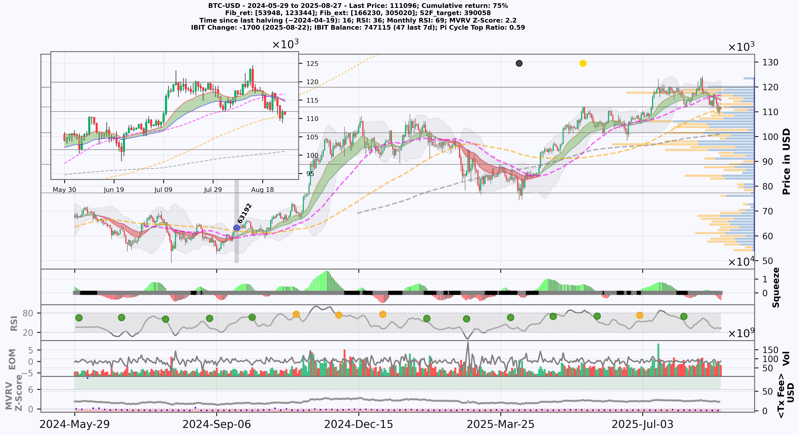

# Bitcoin Trading Indicator for Informed Investment Decisions
Advanced Bitcoin indicator for strategic investment decisions, delivering consistent returns while minimizing drawdown risk.

## Introduction

This implementation provides a comprehensive investment strategy for Bitcoin (BTC) only. It combines multiple technical indicators and real-time on-chain data, which allows investors to make informed decisions regarding entry and exit points in the volatile BTC market. The strategy is designed to help achieve cumulative returns while minimising drawdown risk. The aim is to provide a holistic approach to BTC investments, considering both trend direction and momentum signals. Signals are generated on daily candles and are intended for spot BTC exposure; no leverage or short positions are assumed.

Backtest results use daily data and exclude leverage. **Figures are for research only, not financial advice!**

## Example period

The example showcases market behavior from October 2022 to August 2025, demonstrating precise market entries and capitalizing on buy and sell opportunities, thereby achieving a **cumulative return of ~540%**. 
The main plot shows the bitcoin-price as a OHCL candle chart. Gray vertical bars indicate entry and exit time-positions, whereby red dots are sell points and blue dots are buying points. The purple dotted line is the long-term holder realized prise. Dashed magenta and grey lines are the 50- and 200-days moving averages, with intesections highlighted as yellow (golden-cross) and black-dots (death-cross). Below the main plot are some important indicators: (1) squeeze-momentum, (2) RSI with colored dots indicating monthly RSI ranging from blue to red, (3) Volume and EOM, and (4) MVRV Z-scrore and current transaction costs.

## Performance

This strategy has demonstrated strong performance between 2019 and 2025, accurately identifying both the top and bottom of the Bitcoin market, thereby **avoiding 412 days of continuous market downtrend**. This has resulted in an impressive 6028% return - compared to a buy and hold strategy that would have yielded "only" 1500% for the same period and with considerably higher risk! During prolonged downtrends the strategy emphasizes capital preservation by stepping aside rather than forcing exposure.

In addition, this strategy has also been backtested on historical data yielding consistent returns over an extended timeframe (Sept 2014 - Aug 2025). In particular, it successfully predicted the BTC bear-market bottom in 2015, 2019, and 2022 as well as the market top of the 2017 and 2021 bull-market. However, if this strategy continues to work in the future remains to be seen. Out-of-sample behavior may differ if market microstructure or on-chain dynamics change

## Current market stage

The panel below tracks the market stage since the last breakout in Nov 20224 and includes a 90-day inset for recent detail.  
Green/red shading indicate upward or downward trends. The volume profile on the right highlights high-volume and low-volume nodes; the horizontal lines mark support/resistance areas derived from those nodes.

<em>Notes:</em> Price shown in USD. Shading = short-term MACD spread; not a standalone signal. Volume profile peaks often align with **support/resistance**. Figure last updated: 2025-08-27.

## Some indicators and on-chain data included in this implementation

- **Squeeze Momentum Indicator**: Identifies the beginning and end of trends by combining Bollinger Bands and Keltner Channels.
- **Moving Average Divergence Convergence (MACD)**: used to determine trend direction through the crossing of short-term and long-term moving averages.
- **Relative Strength Index (RSI)**: Evaluates overbought or oversold conditions in BTC's price, providing insights into potential reversal points.
- **Ease-of-Movement (EOM)**: Measures price change relative to volume, highlighting trend strength and potential reversals.
- **MVRV Z-Score**: Identifies Bitcoin overvaluation or undervaluation by comparing market and realized value.

## Usage Note

This script was developed solely for personal investment decision-making and not financial advice. For collaboration or questions, feel free to get in touch.

## Contributors

- [Sebastian Ehrig](https://github.com/Sebastian-ehrig)
